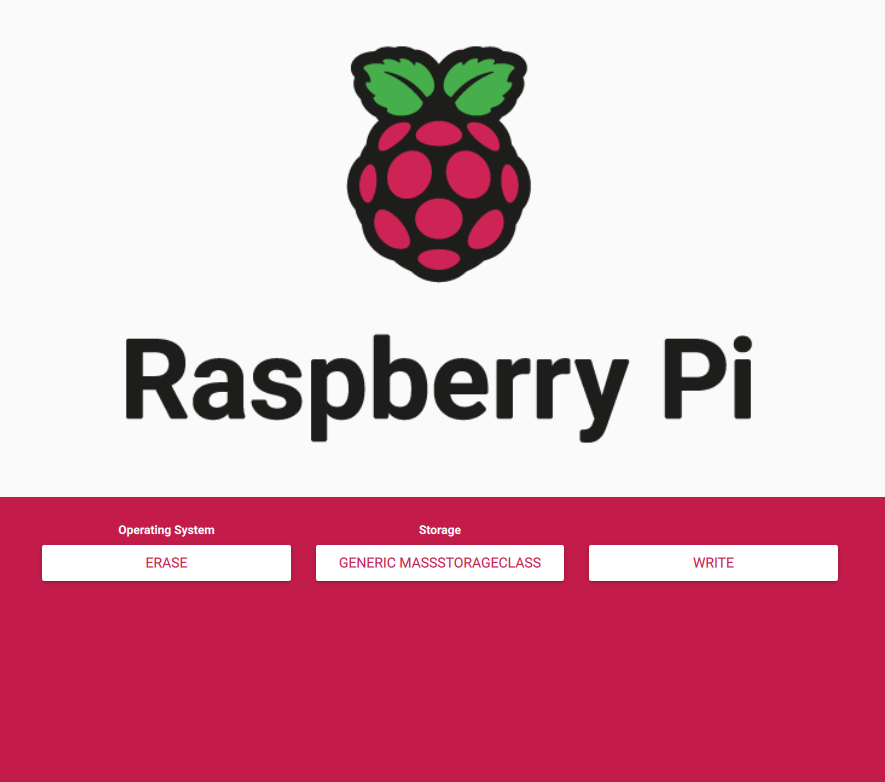
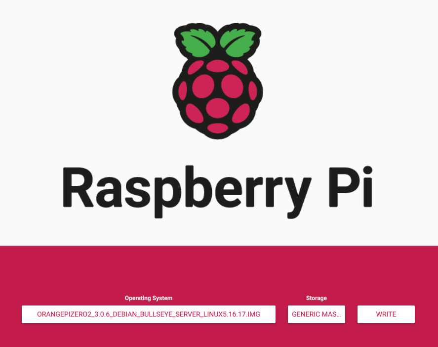

<h1 align="center">Orange Pi Zero 2 with Official Image</h1>

## About

This guide will help you to install the official image for your Orange Pi Zero 2, I guess it can be use for other models.</p>


### Requirements:
- Orange Pi Zero 2.   
- Power Source.  
- SDCard. Class 1(A1) or Class 2(A2)  
- Ethernet Cable.  
- Router Access.  

**Steps:**
1. Download Image from the official Orange Pi website.  
2. Download the Raspberry Pi imager.  
3. Add the Orange Pi image into the SDCard.  
4. Connect to the OrangePi using the ethernet connection and login using SSH.  
5. Change password.  
6. Change sources for downloading packages.  
7. Update and Upgrade..  
8. Activate Wifi.  
9. Delete oranpi user


## Download the image from the website.

<p>Go to the official <a href="http://www.orangepi.org/html/serviceAndSupport/index.html" target='_blank'>Orange Pi </a>website, select your board.</p>

Select a distro, for this guide I will pick Debian, but feel free to select any other.

**All the distros are save in google drive.**

Pick a version, at this time I will download Orangepizero2_3.0.6_debian_bullseye_server_linux5.16.17, this version is the headless version. This will not have a desktop enviorment, if you like to use one with it, choose the xfce or the desktop version.

<h2>Download Raspberry Pi Imager</h2>

<p>You can install this software using the terminal or downloading the app from the <a href="https://www.raspberrypi.com/software/">Raspberry</a> website.</p>

**Terminal:**

```bash
sudo apt install rpi-imager
```

## Format SDCard, and add image

**Format SDCard**

1. Open Raspberry Pi Imager.
2. Plug the SDCard.
3. Choose OS.
4. Select Erase.
5. Choose Storage and select your SDCard.
6. Select Write and Confirm.
7. Close app and open it again.


<div align="center">

</div>


**Add Image in to the SDCard**

1. Select Choose OS.
2. Select Use custom.
3. Select the OrangePi Image.
4. Select Choose storage and select your SDCard.
5. Select Write.
6. Eject the SDCard safely.


<div align="center">

</div>

**If for some reason you have problems writing the image try to open the app with sudo.**

```bash
sudo rpi-imager
```

## Connect to the OrangePi using the ethernet connection and login using SSH.

Plug the SDCard into the Orange Pi, the ethernet cable, and for last the power source.

**The first boot takes time so be patient.**

**Find the ip of the Orange Pi.**

You can do this using the terminal.

```bash
sudo apt install arp-scan
sudo arp-scan --localnet
```

Or you can login into your router and look for it.

Login using root and password:

user:root

password: orangepi

```bash
ssh root@paste_the_ip_from_the_opi_here
```

<h2>Change password</h2>

```bash
passwd
```

## Change sources for downloading packages.

Change the source of the packages for downlaods, insted of using the repo from China we will use the official repo.

```bash
nano /etc/apt/sources.list
```
**Delete the default repos and add this ones instead**

```bash
deb http://deb.debian.org/debian bullseye main contrib non-free
#deb-src http://deb.debian.org/debian bullseye main contrib non-free

deb http://deb.debian.org/debian bullseye-updates main contrib non-free
#deb-src http://deb.debian.org/debian bullseye-updates main contrib non-free

deb http://deb.debian.org/debian bullseye-backports main contrib non-free
#deb-src http://deb.debian.org/debian bullseye-backports main contrib non-free

deb http://security.debian.org/ bullseye-security main contrib non-free
#deb-src http://security.debian.org/ bullseye-security main contrib non-free
```
Save the file.

**Reboot**

```bash
reboot
```

Login using SSH using your new password.

## Update and Upgrade

```bash
apt update
apt upgrade
```

## Activate Wifi.

To activate the wifi, turn off the bluetooth, make a wifi access point, install IR support

```bash
orangepi-config
```

## Delete orange pi user

## By default a orangepi user is created, to delete the this user use:

```bash
deluser --remove-all-files orangepi
```

**Extras:**

Turn system off.

```bash
shutdown now
```

Reboot

```bash
reboot
```

## Extras:

As a root:

Add a new user.

```bash
useradd name_of_the_user_here
```

Add user to the sudo group.

```bash
adduser user_name_here sudo
```

Switch user.

```bash
su user_name_here
```

Disable root.

```bash
sudo passwd root -ld
```

**Flags**

**-ld:** Lock and delete.

Search for a package.

```bash
apt search neofetch
```

Install packages.

```bash
apt install neofetch
```

Delete packages.

```bash
apt purge neofetch
```

Check process.

```bash
htop
```


If you find this guide useful please give it a star and share.
