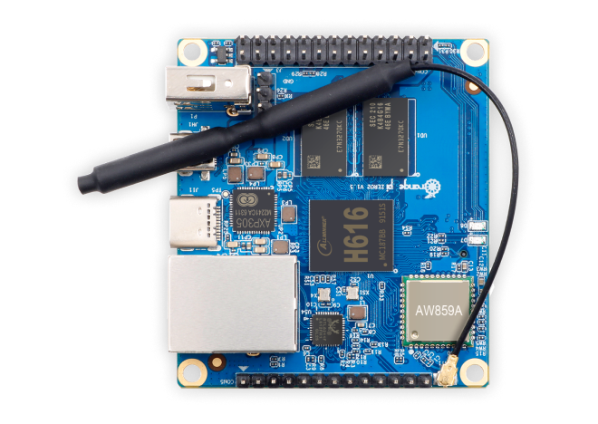

<h1 align="center">Orange Pi Zero 2 with Armbian Legacy Kernel</h1>


<div style='display:inline-block' align='center'>
 Wifi 
 Bluetooth
 USB  
 Power Off   
 Reboot  
</div>

<div align='center'> 
  
</div>

### Requirements:
- Orange Pi Zero 2.   
- Power Source.  
- SDCard. Class 1(A1) or Class 2(A2)  
- Ethernet Cable.  
- Router Access.  

**Steps:**
1. Clone Armbian build from the github repo.
2. Create an Armbian Image with Legacy Kernel.
3. Format SDCard.
4. Add Armbian Image to SDCard.
5. Connect to the OrangePi using the ethernet connection and login using SSH.
6. Activate Wifi.
7. Freeze Kernel.
8. Update and Upgrade.

## 1. Clone Armbian build from the github repo.

Go to [Armbian official Repo](https://github.com/armbian/build) and clone the repo into your Downloads folder.

```bash
cd Downloads/
git clone https://github.com/armbian/build.git
```


## 2. Create an Armbian Image with Legacy Kernel.

This step will take around 20 min so be patient.
Once you complete the past step go into the build folder.

```bash
cd build/
```

Run compiler.

```bash
sudo ./compile.sh
```

**Choose the following options.**

- Do not change the kernel configuration.
- orangepizero2
- legacy Old stable / Legacy
- bullseye Debian Bullseye
- Standard image with console interface.

Once the proccess is completed you will find the image here:

```bash
~/Downloads/build/output/images/your_Armbian.img
```

## 3. Format SDCard.

Plug the SDCard into your computer and format it. FAT32

You can use **gparted** to do it.
If you don't have gparted you can install it using:

```bash
sudo apt install gparted
```

## 4. Add Armbian Image to SDCard.

For this step you can use programs like:

<p>
<a href="https://www.balena.io/etcher/">balenaetcher</a> this software include <a href="https://github.com/balena-io/etcher/issues/2977">spyware</a>
</p>

<p>
<a href="https://www.raspberrypi.com/software/">Raspberry Pi Imager</a>
</p>

```bash
sudo apt install rpi-imager
```

Using the terminal:

Make sure that you SD card is unplugged. Then run df -h . You should see something like this:

```bash
df -h
Filesystem      Size  Used Avail Use% Mounted on
/dev/sda1       119G   79G   34G  70% /
none            4.0K     0  4.0K   0% /sys/fs/cgroup
udev            7.8G   12K  7.8G   1% /dev
tmpfs           1.6G  1.1M  1.6G   1% /run
none            5.0M     0  5.0M   0% /run/lock
none            7.9G  1.5M  7.9G   1% /run/shm
none            100M  3.7M   97M   4% /run/user
```

Now insert you SD card and run df again. See the new entry (/dev/sdb1)? That is your SD card. sdb is the actual device name and 1 is the partition number. Your actual device may be named something different.

```bash
df -h
Filesystem      Size  Used Avail Use% Mounted on
/dev/sda1       119G   79G   34G  70% /
none            4.0K     0  4.0K   0% /sys/fs/cgroup
udev            7.8G   12K  7.8G   1% /dev
tmpfs           1.6G  1.1M  1.6G   1% /run
none            5.0M     0  5.0M   0% /run/lock
none            7.9G  1.5M  7.9G   1% /run/shm
none            100M  3.7M   97M   4% /run/user
/dev/sdb1       2.0G  0.0G  2.0G   0% /media/user/LABEL
```

Unmount your SD card. If it has more than one partition, you will need to do this for each partition.

```bash
sudo umount /dev/sdb1
```

This is the **dangerous** part. If you pick the wrong device, you could wipe out your hard drive, so be careful!. When specifying the device, don’t include the partition number.

```bash
sudo dd bs=4M if=your_Armbian_image_here.img of=/dev/sdb
```

When copying the image file has completed, run…

```bash
sync
```

Safely eject the SDCard.

## 5. Connect to the OrangePi ethernet connection and login using SSH.

- Plug the SDCard into the Orange Pi.

- Connect the Ethernet cable in to your router and into the Orange Pi.

- Connect the power source.

The first boot takes some time so be patient.

**Get the IP of the Orange Pi**

Examples:

You can login into your router and look for the ip of th Orange Pi or you can use arp-scan.


Using arp-scan

```bash
sudo apt install arp-scan
sudo arp-scan --localnet
```

Once you locate the ip you can login using SSH.

user: **root**

password: **1234**

```bash
ssh root@ip_of_the_orange_pi_here
```

- Add a new password for root.

- Add a new user.

- Add a password for the new user.

- Select bash or zsh.

- Select keyboard input.

**IMPORTANT**

:warning: **DON'T UPDATE OR UPGRADE YET.**

## 6. Activate Wifi.

```bash
armbian-config
```

Select:
Network -> Wifi
Select your network and add password.

## 7. Freeze Kernel.

**If you don't do this and you update and upgrade armbian the wifi will stop working.**

Select:
System -> Freeze -> Freeze

## 8.Update and Upgrade

Now you can update and upgrade the system without breking the kernel.

```bash
apt update
apt upgrade
```

## Extras.

Armbian config

```
armbian-config
```

Turn off the Orange Pi.

```bash
shutdown now
```

Search for packages.

```bash
apt search neofetch
```

Install package.

```bash
apt install neofetch
```

Delete package.

```bash
apt purge neofetch
```

If you find this guide useful please give it a star and share.

**Special thanks to all the people working on Armbian.**

Please don't forget to [donate](https://www.armbian.com/donate/) to the Armbian project, thanks to them we can use this amazing distro.

Note:
**If someone find how to make work the wpa_supplicants please fork this repo and make a pull request so I can add it into the guide.**
