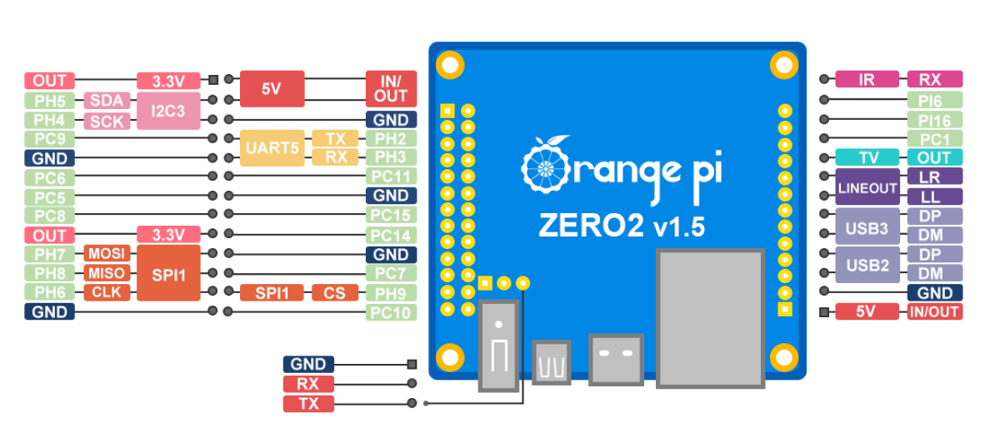
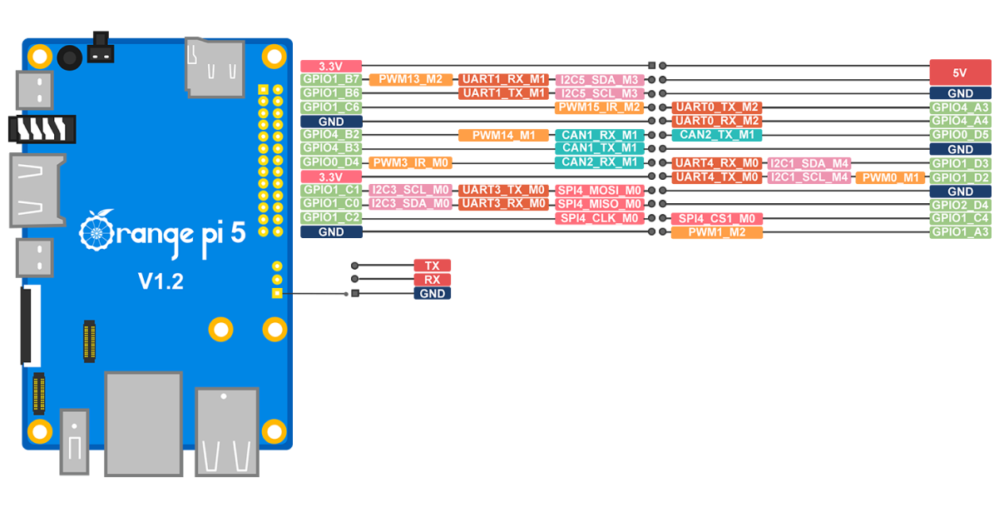

<h1 align='center'>Oled SSD1306 i2c</h1>

## About

This guide is for the Orange Pi zero 2 and Orange Pi 5.

### Wiring the oled.

DO NOT CONNECT THE DISPLAY IF THE ORANGE PI IS ON.





ORANGE PI ZERO 2  

GND pin 6  
VCC pin 1  
SDA pin 3  
SCK pin 5  

### ENABLE I2C PINS ORANGE PI ZERO 2

```bash
sudo nano /boot/orangepiEnv.txt
overlays=i2c3
```



ORANGE PI 5  

GND pin 6  
VCC pin 1  
SDA pin 21  
SCK pin 19  

### ENABLE I2C PINS ORANGE PI 5 

```bash
sudo nano /boot/orangepiEnv.txt
overlays=i2c3-m0
```

### Add user to group i2c

```bash
sudo adduser your_username_here i2c
```

### Reboot

```bash
sudo reboot
```

### Update and Upgrade

```bash
sudo apt update
sudo apt upgrade
```

### Install packages and dependencies.

```bash
sudo apt install i2c-tools python3-pip
```

```bash
pip3 install pillow
pip3 install smbus2
```

### Clone ssd1306 repository

```bash
git clone https://github.com/codelectron/ssd1306.git
cd ssd1306
sudo python3 setup.py install
```

### Test

```bash
cd examples/
touch oledtest.py
nano oledtest.py
```

Add this code.

```python
from oled.device import ssd1306, sh1106
from oled.render import canvas
from PIL import ImageFont, ImageDraw

bitmap_font='C&C Red Alert [INET].ttf' # Font to use.

device = ssd1306(port=3, address=0x3C) # substitute sh1106(...) below if using that device

with canvas(device) as draw:
    font = ImageFont.load_default()
    # font = ImageFont.truetype('./fonts/' + bitmap_font, 16)
    # draw.rectangle((0, 0, device.width, device.height), outline=0, fill=0)
    draw.text((0,  40), "fishstick nom", font=font, fill=255)
```

Save and Run test.  

```bash
python3 oledtest.py
```

## Fonts
<p>For more fonts <a href="http://www.dafont.com/bitmap.php">dafont</a> </p>

Once you download it save it in the fonts folder.

## Special Thanks

Richard Hull and codelectron for made this possible.

If you find this guide useful please give it a star and share.
